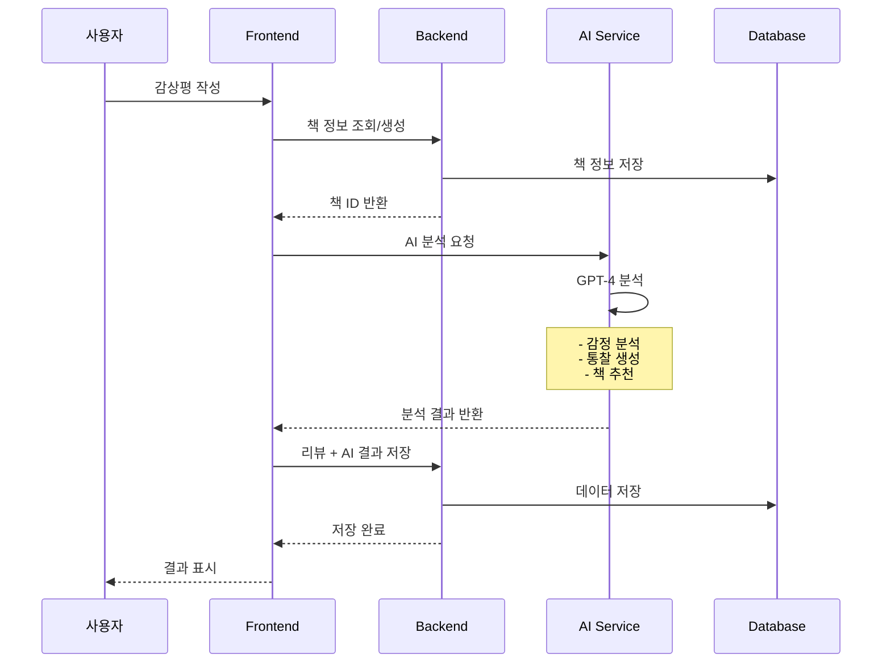

# 📚 BookLLM - AI 독서 감상평 플랫폼

AI가 독자의 감정을 이해하고 공감하며, 개인화된 통찰과 추천을 제공하는 지능형 독서 감상평 플랫폼입니다.

## 🌟 주요 기능

- **AI 감상평 분석**: GPT-4 기반 심층 분석으로 독서 경험 향상
- **감정 공감 메시지**: 독자의 감정을 이해하고 공감하는 따뜻한 메시지
- **맞춤형 책 추천**: 읽은 책과 독서 성향을 기반으로 한 개인화된 추천
- **다양한 통찰 제공**: 장르별, 감정별, 평점별 차별화된 분석

## 🏗️ 시스템 아키텍처

```
┌──────────────────────────────────────────────────────────────┐
│                         사용자 (User)                         │
└────────────────────────────┬─────────────────────────────────┘
                             │
                             ▼
┌──────────────────────────────────────────────────────────────┐
│                   Frontend (React + TypeScript)               │
│                        Port: 3001                             │
│  ┌──────────────────────────────────────────────────────┐    │
│  │  - 감상평 작성 UI                                     │    │
│  │  - AI 분석 결과 표시                                  │    │
│  │  - 리뷰 목록 관리                                     │    │
│  │  - Material-UI 컴포넌트                               │    │
│  └──────────────────────────────────────────────────────┘    │
└────────────────┬───────────────────────┬─────────────────────┘
                 │                       │
                 ▼                       ▼
┌─────────────────────────┐  ┌──────────────────────────┐
│  Backend (Spring Boot)  │  │  AI Service (FastAPI)    │
│      Port: 8080         │  │      Port: 8001          │
│ ┌────────────────────┐  │  │ ┌─────────────────────┐  │
│ │ - RESTful API      │  │  │ │ - OpenAI GPT-4 API  │  │
│ │ - JPA/Hibernate    │  │  │ │ - 감정 분석        │  │
│ │ - MySQL 연동       │  │  │ │ - 책 추천 생성     │  │
│ │ - Domain Services  │  │  │ │ - 통찰 생성        │  │
│ └────────────────────┘  │  │ └─────────────────────┘  │
└──────────┬──────────────┘  └──────────────────────────┘
           │
           ▼
┌──────────────────────────────────────────────────────────────┐
│                      MySQL Database                           │
│                        Port: 3306                             │
│  ┌──────────────────────────────────────────────────────┐    │
│  │  Tables:                                              │    │
│  │  - users (사용자 정보)                                │    │
│  │  - books (도서 정보)                                  │    │
│  │  - reviews (리뷰 및 AI 분석 결과)                    │    │
│  └──────────────────────────────────────────────────────┘    │
└──────────────────────────────────────────────────────────────┘
```

## 🔄 데이터 플로우



## 🚀 실행 방법

### 필수 요구사항

- Java 21
- Node.js 18+
- Python 3.12+
- MySQL 8.0+
- Docker (선택사항)

### 1. 데이터베이스 설정

#### Docker를 사용하는 경우:
```bash
docker run -d \
  --name bookllm-mysql \
  -p 3306:3306 \
  -e MYSQL_ROOT_PASSWORD=root1234 \
  -e MYSQL_DATABASE=bookllm \
  mysql:8.0
```

#### 로컬 MySQL을 사용하는 경우:
```sql
CREATE DATABASE bookllm;
CREATE USER 'bookllm'@'localhost' IDENTIFIED BY 'bookllm1234';
GRANT ALL PRIVILEGES ON bookllm.* TO 'bookllm'@'localhost';
FLUSH PRIVILEGES;
```

### 2. Backend 실행 (Spring Boot)

```bash
cd backend

# 환경 설정 (application.yml)
# MySQL 연결 정보를 확인하세요

# 실행
./gradlew bootRun

# 또는 Windows
gradlew.bat bootRun
```

Backend는 http://localhost:8080 에서 실행됩니다.

### 3. AI Service 실행 (FastAPI)

```bash
cd ai-service

# 가상환경 생성 및 활성화
python -m venv .venv

# Windows
.venv\Scripts\activate

# Linux/Mac
source .venv/bin/activate

# 의존성 설치
pip install -r requirements.txt

# 환경 변수 설정 (.env 파일 생성)
echo "OPENAI_API_KEY=your_api_key_here" > .env
echo "USE_MOCK_RESPONSE=true" >> .env  # 테스트용 Mock 응답 사용

# 실행
uvicorn app.main:app --reload --port 8001
```

AI Service는 http://localhost:8001 에서 실행됩니다.

### 4. Frontend 실행 (React)

```bash
cd frontend

# 의존성 설치
npm install

# 개발 서버 실행
npm start
```

Frontend는 http://localhost:3001 에서 실행됩니다.

## 📝 사용 방법

1. **웹 브라우저에서 http://localhost:3001 접속**

2. **감상평 작성**
   - "감상평 작성" 버튼 클릭
   - 책 정보 입력 (제목, 저자, 장르)
   - 감상평 작성 및 감정 선택
   - 평점 선택 (1-5점)

3. **AI 분석 받기**
   - "AI 분석 받기" 버튼 클릭
   - AI가 생성한 공감 메시지 확인
   - 책에 대한 통찰 확인
   - 추천 도서 목록 확인
   - 개인화된 메시지 확인

4. **리뷰 저장**
   - "리뷰 등록하기" 버튼 클릭
   - "내 감상평" 페이지에서 저장된 리뷰 확인

## 🧪 테스트

### E2E 테스트 실행
```bash
cd frontend
npx playwright test
```

### AI Service 테스트
```bash
cd bookllm
python test_ai_service.py
```

## 🛠️ 기술 스택

### Backend
- **Spring Boot 3.2.5**: 웹 애플리케이션 프레임워크
- **Java 21**: 프로그래밍 언어
- **JPA/Hibernate**: ORM
- **MySQL 8.0**: 데이터베이스
- **Gradle**: 빌드 도구

### AI Service
- **FastAPI**: Python 웹 프레임워크
- **Python 3.12**: 프로그래밍 언어
- **OpenAI GPT-4 API**: AI 분석 엔진
- **Pydantic**: 데이터 검증

### Frontend
- **React 18**: UI 라이브러리
- **TypeScript**: 타입 안전성
- **Material-UI v5**: UI 컴포넌트
- **Axios**: HTTP 클라이언트
- **React Router**: 라우팅

## 📁 프로젝트 구조

```
bookllm/
├── backend/                 # Spring Boot 백엔드
│   ├── src/
│   │   ├── main/
│   │   │   ├── java/com/bookllm/
│   │   │   │   ├── api/         # REST 컨트롤러
│   │   │   │   ├── domain/      # 도메인 엔티티
│   │   │   │   ├── global/      # 전역 설정
│   │   │   │   └── infrastructure/  # 외부 서비스
│   │   │   └── resources/
│   │   └── test/
│   └── build.gradle
│
├── ai-service/              # FastAPI AI 서비스
│   ├── app/
│   │   ├── api/            # API 엔드포인트
│   │   ├── models/         # Pydantic 모델
│   │   ├── services/       # 비즈니스 로직
│   │   └── main.py
│   └── requirements.txt
│
├── frontend/                # React 프론트엔드
│   ├── src/
│   │   ├── components/     # 재사용 컴포넌트
│   │   ├── pages/          # 페이지 컴포넌트
│   │   └── App.tsx
│   ├── e2e/                # E2E 테스트
│   └── package.json
│
└── README.md
```

## 🔑 환경 변수

### Backend (.env 또는 application.yml)
```yaml
spring:
  datasource:
    url: jdbc:mysql://localhost:3306/bookllm
    username: bookllm
    password: bookllm1234
```

### AI Service (.env)
```bash
OPENAI_API_KEY=your_openai_api_key
USE_MOCK_RESPONSE=false  # 실제 API 사용 시
```

## 📊 API 문서

### Backend API
- `GET /api/books` - 도서 목록 조회
- `GET /api/books/search` - 도서 검색
- `POST /api/reviews` - 리뷰 저장
- `GET /api/reviews/user/{userId}` - 사용자 리뷰 조회
- `DELETE /api/reviews/{reviewId}` - 리뷰 삭제

### AI Service API
- `POST /api/v1/reviews/analyze` - AI 리뷰 분석
- `GET /api/v1/recommendations` - 책 추천
- `GET /health` - 서비스 상태 확인
